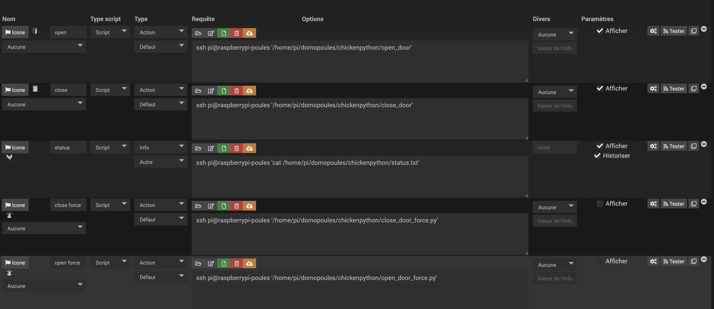

#Domopoules Jeedom configuration

This project relies on following Jeedom plugin to work :
https://doc.jeedom.com/fr_FR/plugins/programming/script/

Once installed on your jeedom, create a new virtual device :

and create following commands :

