layout: true

.footer[Orange internal]

---
name: cover

.logo[]

# Domopoules - domotisation d'un poulailler

.date[05/10/2020]

---

## Teaser

Bon vous avez comme tout le monde, vous avez pris des poules pendant le confinement, les enfants sont ravis...
mais fermer la porte matin et soir vous fatigue et aussi surveiller les volailles à distance serait bien pratique,
tout ça manque de domotique...
Cette session est pour ceux qui comme moi sont vraiment nuls en électronique mais adorent la domotique.
On y parlera aussi de protocoles, portée et consommation électrique.
Mots clés: raspberry pi zero W, raspbian, python, jeedom, zigbee, z-wave, motion eye os, panneaux solaires...

---

## Usage

Présentation pour le .purple[Dev and Test Day 2020]

Réalisé avec Remark.js et le thème orange <https://gitlab.forge.orange-labs.fr/web/remark-orange-boilerplate>

Appuyez sur P pour voir les notes. Puis C pour cloner l'affichage.

???
Présentation qui durera 20 minutes

Comme tout le monde j'ai pris des poules pendant le confinement

---

## Introduction

Les poules, parfait pour occuper les enfants pendant le confinement.

.col-left[ ]
.col-right[ 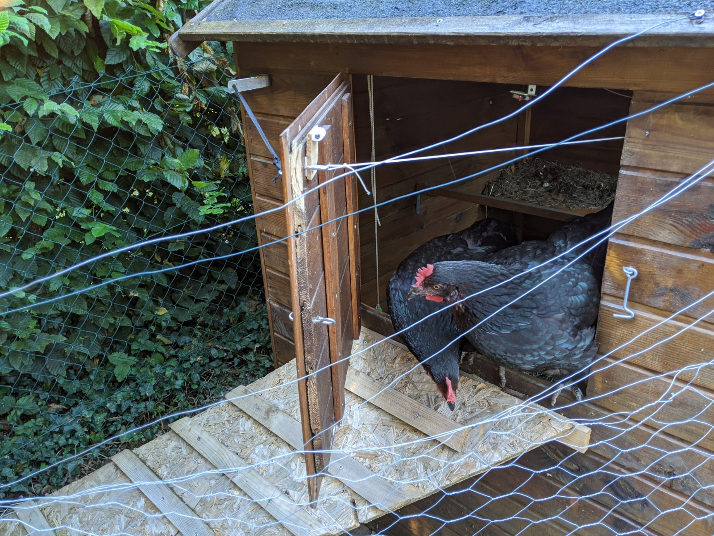]

???
Mais pas mal de contraintes, dont ouvrir et fermer la porte matin et soir

---

## Introduction - 2

Le poulailler le lieu parfait pour innover en domotique.

Objectifs:

- ouvrir automatiquement la porte du poulailler
- Objectifs suivants : surveillance (présence des poules en intérieur, nombre d'oeufs...)

???
Pratique de la domotique dans la maison depuis qques années.
Le WAF est très bon.

---

## Agenda

1. Présentation de centrale domotique sous Jeedom
2. Le problème de la portée
3. Le coeur du système, le raspberry pi zero WH
4. La couche logicielle
5. La solution technique
6. Le problème de l'alimentation
7. Pour aller plus loin

---

## Présentation de Jeedom

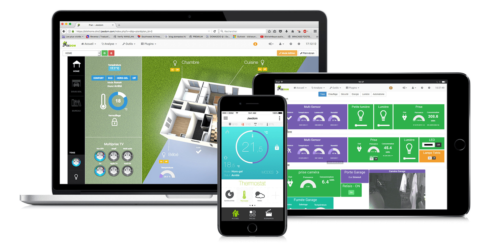

Open source. Français (Lyon).

???

opensource, boite française

S'installe sur un raspberry pi (3 ou 4 pas zero)

Système très ouvert : compatible zwave, philips Hue,  ikea..., google smarthome, alexa...

---

## Présentation de Jeedom - 2 - les plugins


???

possibilité de réutiliser périphériques homelive

possibilité de changer de technologie au fil du temps : abstraction des devices

passage des devices homelive (z-wave) à des device aqara (zigbee) puis bluetooth / Wi-Fi

---

## Présentation de Jeedom - 3 - Business model


Vente de:

- boxes sur étagère
- plugins
- service de sauvegarde, de SMS, de noms de domaine

???

testé également domoticz

Au final une bonne solution stable évolutive peu couteuse

---

## Le problème de la portée

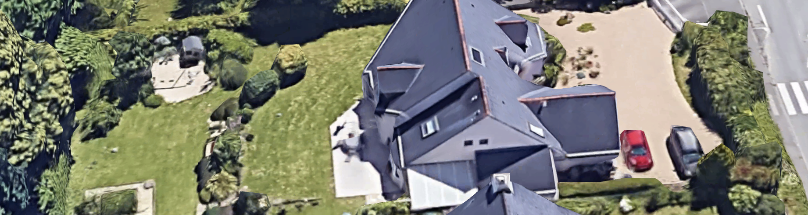
Le poulailler est à 30 mètres de la box domotique

- zigbee ==> KO
- z-wave ==> MOUAIS
- Wi-Fi ==> OK

.col-left[ 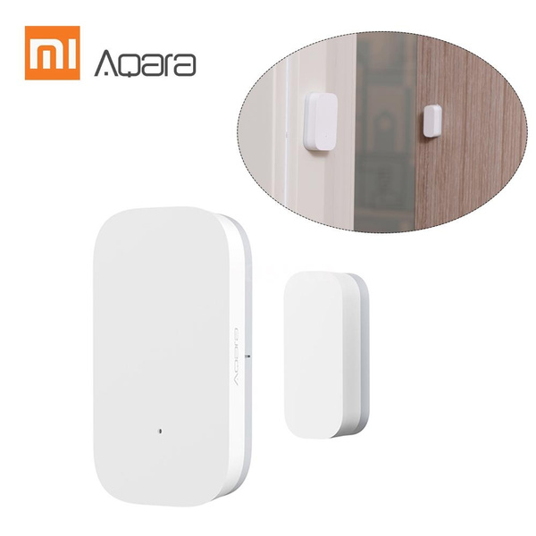]
.col-right[ 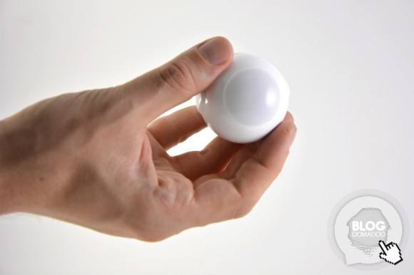]

???
z-wave portée officielle 50m (plus extérieur moins en intérieur)
Zigbee 100m?
---

## Le problème de la portée - 2 - Rappel réseaux maillé

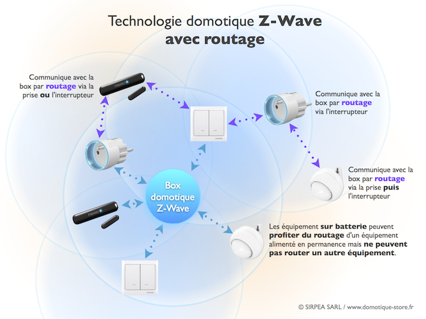

???
zwave réseau maillé qui se reconfigure

---

## Le problème de la portée - 3 - Mais est-ce lié au protocole

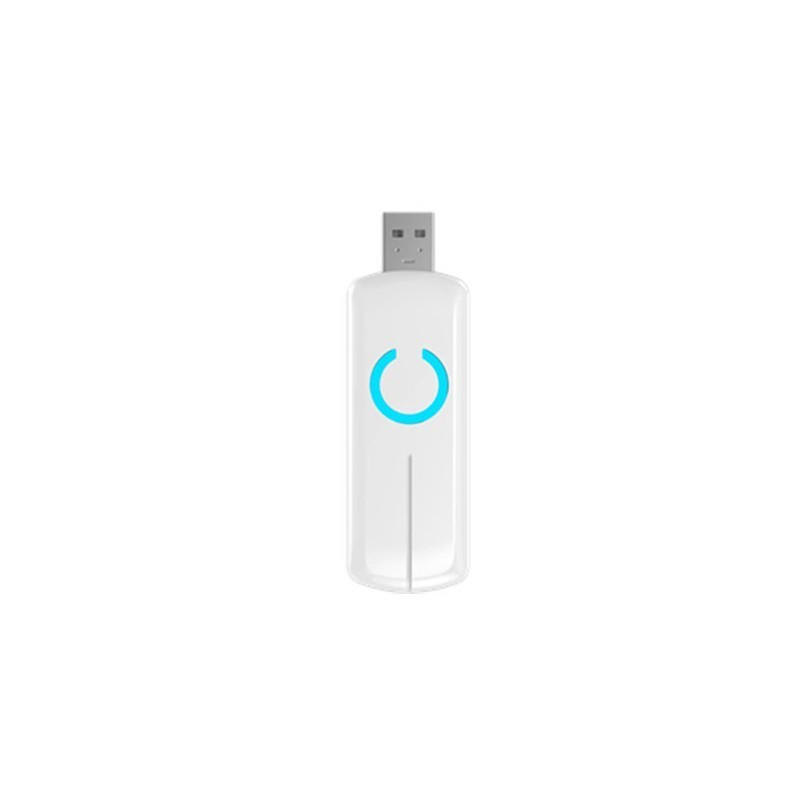

???

---

## Le problème de la portée - 4 - Mais est-ce lié au protocole

Probablement plus au hardware

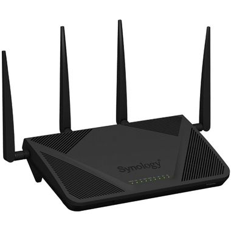

???
Quoi qu'il en soit ce sera du Wi-Fi

---

## Des solutions éxistent sur le marché

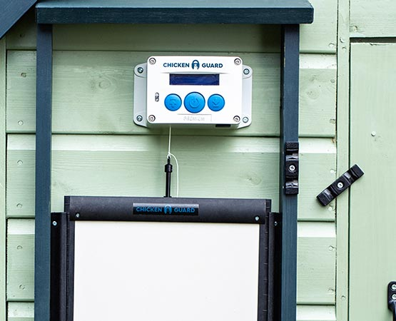

???
Ici chickenguard
Mais cher(140€), pas domotisé, pas adapté à ma cabane.


---

## Le coeur du système - solutions abandonnées

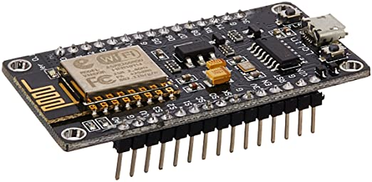

Node MCU ESP 8266 ==> un arduino avec du Wi-Fi

???
L'ESP8266 est un circuit intégré à microcontrôleur avec connexion Wi-Fi développé par le fabricant chinois Espressif

3euros
utilisation IDE arduino

trop bas niveau pour moi, trop lourd à mettre à jour.

---

## Le coeur du système - 2 - Raspberry pi zero WH

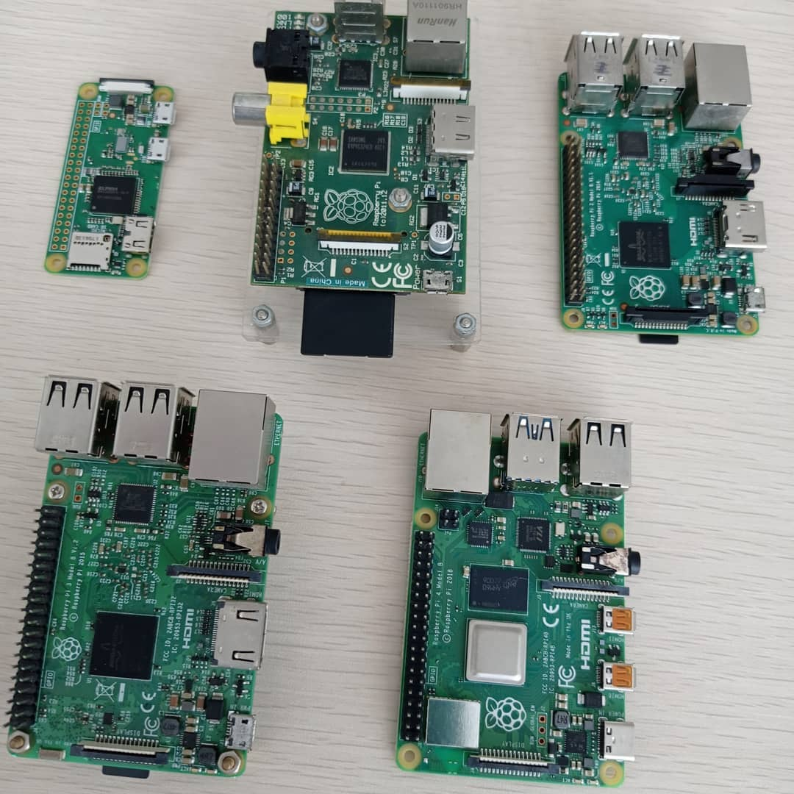

Photo de famille : 0 / 1 / 2 / 3 / 4

???

utilisation raspberry pi 3 depuis qques années

Toujours un GPIO sur lesques on peut brancher de montages électroniques (simples)

---

## Le coeur du système - 3 - Raspberry pi zero WH

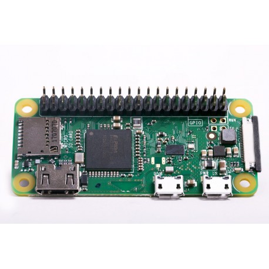

<https://www.kubii.fr/cartes-raspberry-pi/2076-raspberry-pi-zero-wh-kubii-3272496009394.html>

???
- Le raspberry pi zero + W ==> du Wi-Fi + H ==> connecteur GPIO soudé
- Pour ceux qui galèrent avec les arduino / ESP TODO
- Un vrai linux accessible en SSH, un vrai IDE direct dessus (Vim), Git...
- On peut écrire directement en python
- Pas cher : 10-15€, mais il faut y ajouter la carte SD

---

## La couche logicielle - Présentation de Rpi.GPIO

<https://pypi.org/project/RPi.GPIO/>

???
Date de 2012

---

## La couche logicielle - 2 - présentation de gpiozero

<https://gpiozero.readthedocs.io/en/stable/recipes.html>

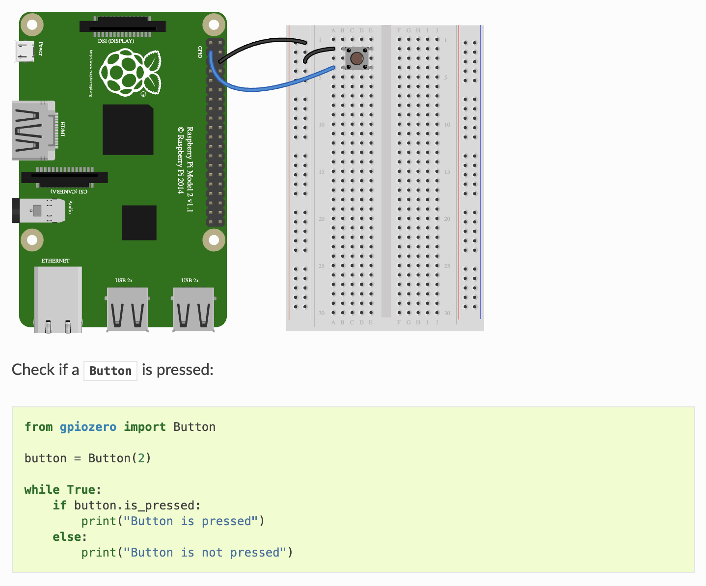

---

```python
from gpiozero import Button

button = Button(2)

# Check if a Button is pressed:

while True:
    if button.is_pressed:
        print("Button is pressed")
    else:
        print("Button is not pressed")

# Wait for a button to be pressed before continuing:

button.wait_for_press()
print("Button was pressed")


# Run a function every time the button is pressed:

def say_hello():
    print("Hello!")

button.when_pressed = say_hello

pause()
```

---

## La couche logicielle - 3 - présentation de gpiozero - 2

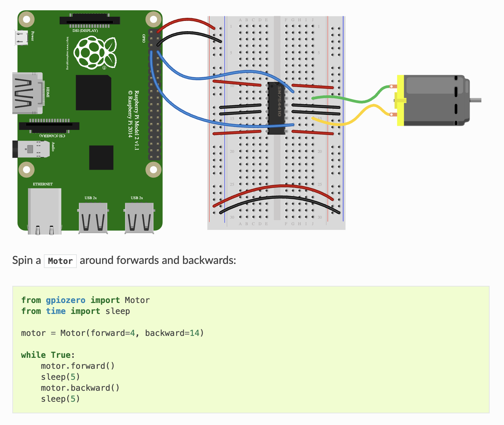

---

## La solution technique

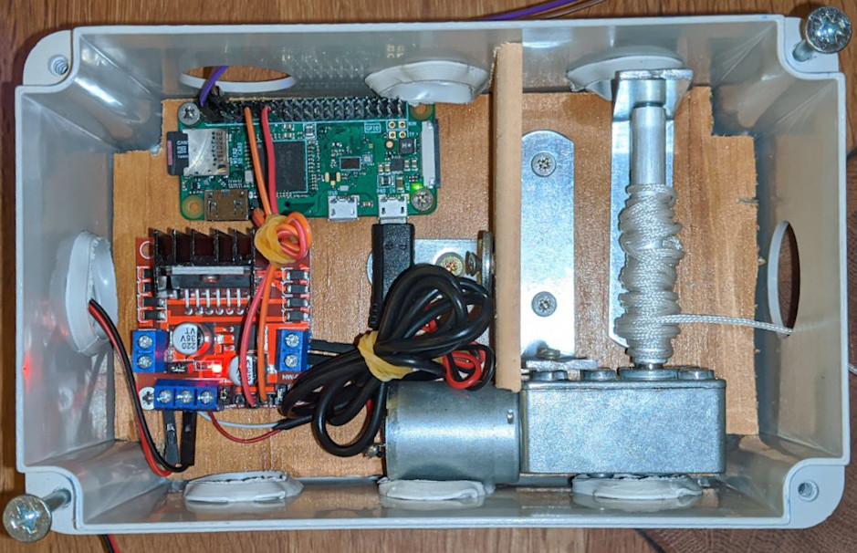

????

---

## La solution technique - 2 Pont en H L298N

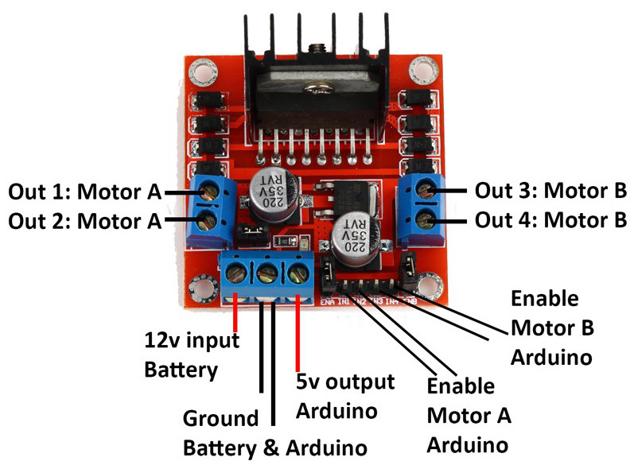

????

Réagir à un ordre de faible puissance envoyé par le raspberry pi en envoyant du courant de plus forte puissance.

Coût 5€

---

## La solution technique - 2 Code (simplifié)

```python
from gpiozero import Motor
from gpiozero import Button
import time

motor = Motor(forward=17, backward=22)
button = Button(2)

def open_door():
    motor.forward()
    time.sleep(69)
    motor.stop()

def close_door():
    time_spent=0
    motor.backward()
    while not button.is_pressed and time_spent<99:
      time.sleep(1)
      time_spent+=1
    motor.stop()
```
???

Code appellé en SSH via le plugin script de Jeedom

---

## La solution technique - 2 Code (simplifié)

```python
import RPi.GPIO as gpio
import datetime
import time
import logging

TIME_CLOSE = 100
TIME_OPEN = 83

def init():
    gpio.setmode(gpio.BCM)
    gpio.setup(17, gpio.OUT)
    gpio.setup(22, gpio.OUT)


def open_door():
    gpio.output(17, True)
    gpio.output(22, False)
    time.sleep(TIME_CLOSE)
    gpio.cleanup()

def close_door():
    gpio.output(17, False)
    gpio.output(22, True)
    time.sleep(TIME_OPEN)
    gpio.cleanup()
```

---

## Le problème de l'alimentation

Naivement je pensais que le raspberry pi zero ne consommerait rien et tiendrait qques semaines sur une batterie USB...

Que Neni
Consommation :

Raspberry pi zero WH : 90mah
L298 : 6mAh (si VEN = LOW), 24mAh sinon.

104mah pour une batterie de 7Ah ===> 3 jours

---

## Le problème de l'alimentation - solution solaire

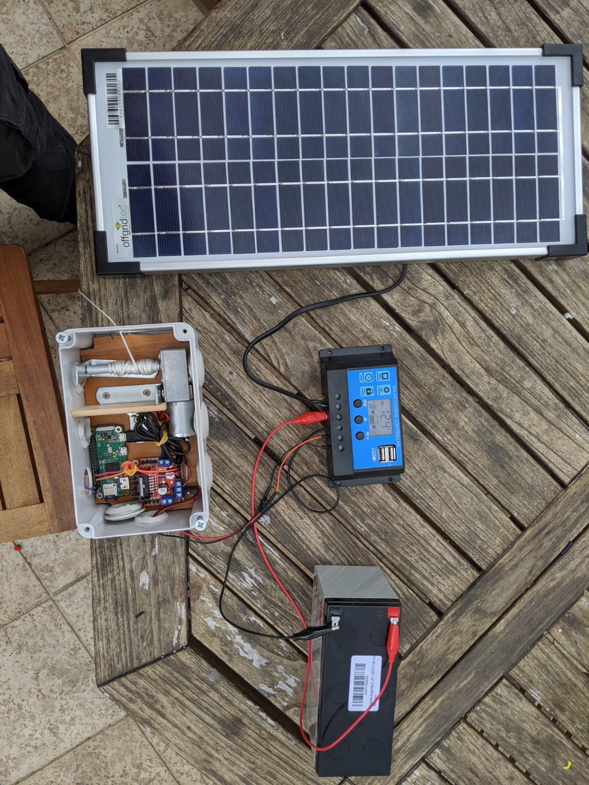

???

cout

| Article                   | tarif | ref                                                                                                         |
|---------------------------|-------|-------------------------------------------------------------------------------------------------------------|
| Controleur de charge      | 14€   | <https://www.amazon.fr/gp/product/B071ZZ2S84>                                                               |
| panneau solaire 12 v 10 w | 22€   | <https://www.amazon.fr/gp/product/B00TYDIMJU>                                                               |
| batterie 12V 7Ah          | 19€   | <https://www.amazon.fr/gp/product/B009D0KFOO>                                                               |

---

## Coût final

| Article                   | tarif |
|---------------------------|-------|
| pont en H                 | 5€    |
| raspberry pi zero W       | 11€   |
| moteur 12 V à engrenage   | 17€   |
| boitier electrique        | 14€   |
| Controleur de charge      | 14€   |
| panneau solaire 12 v 10 w | 22€   |
| batterie 12V 7Ah          | 19€   |
| TOTAL                     | 102   |

---

## Pour aller plus loin - surveillance vidéo

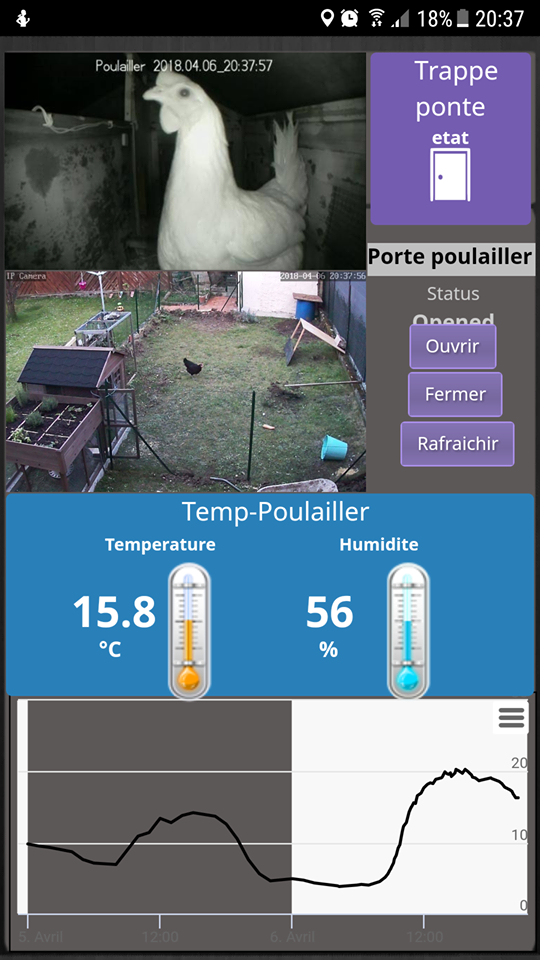
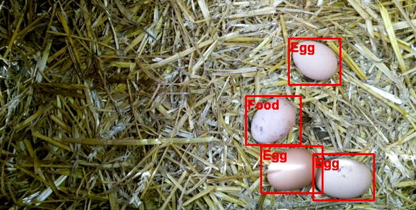

???

Etape suivante naturelle dans la domotisation : la vidéo surveillance
Permettre :
- surveillance poules
- détection ponte

Là encore le raspberry pi zero peut aider.

???

Mais mauvaise expériences par le passé avec :
- les caméras trendnet ==> pas maintenues
- les caméras chinoises (brico dépot) ==> système complétemene fermé

---

## Pour aller plus loin - 2 - raspberry zero WH

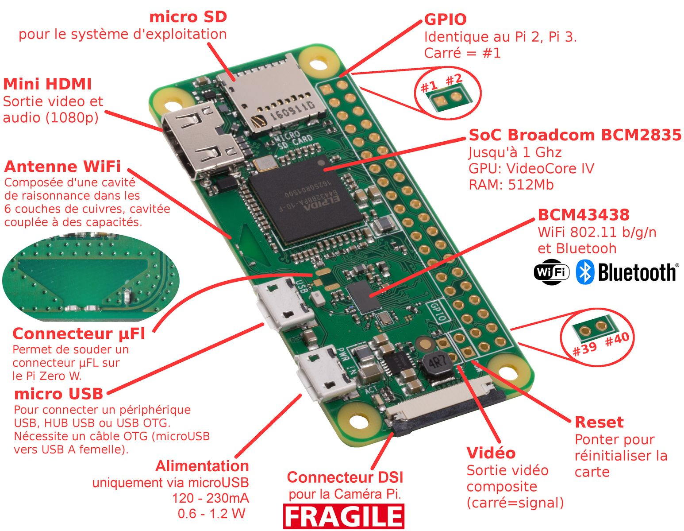

---

## Pour aller plus loin - 3 - raspberry zero WH

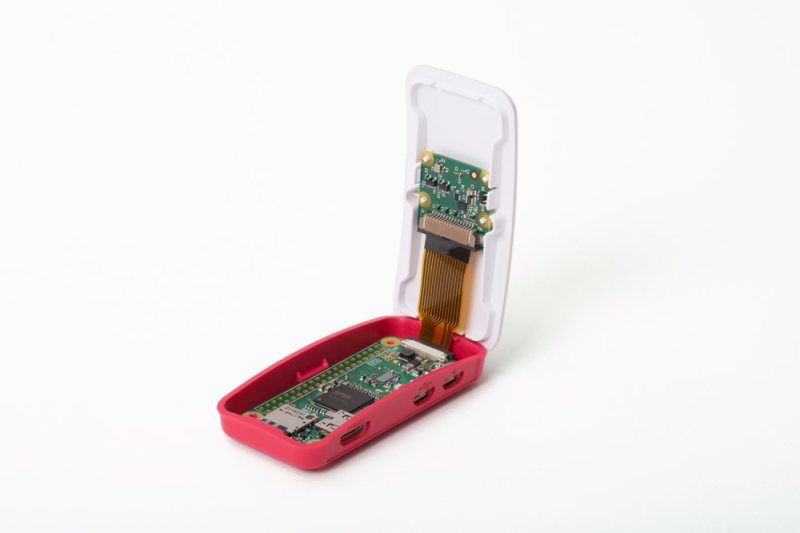

???

---

## Pour aller plus loin - 4 - Motion eye OS

<https://github.com/ccrisan/motioneyeos>


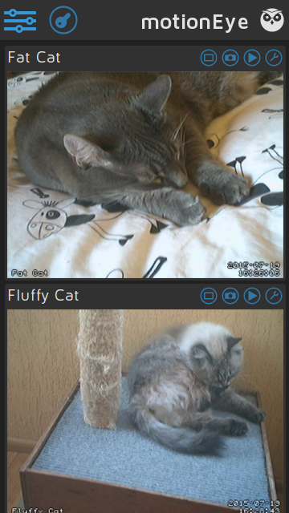


???

- soft open source
- moins cher qu'une caméra chinoise pleine de spywares.
---

## Pour aller plus loin

Utilisation de l'API Google Vision : <https://cloud.google.com/vision/>

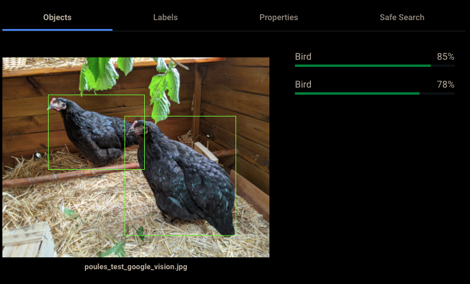

cf [returned Json](./resources/api_vision_result.json)

Voir :

<http://www.brico-info.com/conception-et-fabrication-dun-poulailler-connecte/>

---
name: back-cover

# thank you

.logo[]

---

# title of a slide

## subtitle of a slide

Lorem ipsum dolor sit amet, consectetur adipiscing elit. Duis ac nisl nec lectus consequat laoreet a nec urna. Aenean turpis odio, aliquet vitae ante non, varius rutrum massa. Etiam faucibus laoreet ligula et porttitor. Donec et lorem sapien.

Nam mattis est ligula. Quisque faucibus lorem et fringilla pretium. Proin lacinia diam id magna imperdiet, feugiat iaculis est luctus. Mauris et sodales ipsum.

## another subtitle of a slide

Lorem ipsum dolor sit amet, consectetur adipiscing elit. Duis ac nisl nec lectus consequat laoreet a nec urna. Aenean turpis odio, aliquet vitae ante non, varius rutrum massa. Etiam faucibus laoreet ligula et porttitor. Donec et lorem sapien. Nam mattis est ligula. Quisque faucibus lorem et fringilla pretium. Proin lacinia diam id magna imperdiet, feugiat iaculis est luctus. Mauris et sodales ipsum.

???

some comments

- in markdown
- and rendered !

---

# rich text

You can format text to *italic* and **bold** emphasis.

> You can also quote someone.
>
> Lao Tseu

[Linking](http://www.example.com) is very easy !

New official colors :

- .blue[**blue font**] or .bgblue[**blue background**]
- .yellow[**yellow font**] or .bgyellow[**yellow background**]
- .green[**green font**] or .bggreen[**green background**]
- .purple[**purple font**] or .bgpurple[**purple background**]
- .pink[**pink font**] or .bgpink[**pink background**]

---

# example of a table

Lorem ipsum dolor sit amet, consectetur adipiscing elit. Duis ac nisl nec lectus consequat laoreet a nec urna. Aenean turpis odio, aliquet vitae ante non, varius rutrum massa. Etiam faucibus laoreet ligula et porttitor. Donec et lorem sapien. Nam mattis est ligula. Quisque faucibus lorem et fringilla pretium. Proin lacinia diam id magna imperdiet, feugiat iaculis est luctus. Mauris et sodales ipsum.

| header 1               | header 2                | header 3      | header 4                 |
| ---------------------- | ----------------------- | ------------- | ------------------------ |
| line 1 cell 1          | line 1 cell 2           | line 1 cell 3 | line 1 cell 4            |
| line 2 cell 1          | .bggreen[line 2 cell 2] | line 2 cell 3 | line 2 cell 4            |
| line 3 cell 1          | line 3 cell 2           | line 3 cell 3 | .bgpurple[line 3 cell 4] |
| .bgblue[line 4 cell 1] | line 4 cell 2           | line 4 cell 3 | line 4 cell 4            |

---

# code snippets

You can add some code snippets in your presentation. It is automatically highlighted!

```java
public class HelloWorld
{
	public static void main(String[] args) {
*		System.out.println("I love remark!");
	}
}
```

And you can also hightlight some particular lines in yellow.

---

# rich content

- list item
  - sublist item
  - sublist item
- another list item
  1. sublist item
  1. sublist item

This image is embedded in the markdown file : ![couch](%3D%3D)

This is a real png image (centered) :

.center[]

---
class: two-cols

# two columns

The content can be displayed in 2 columns.

.col-left[
## column 1

Lorem ipsum dolor sit amet, consectetur adipiscing elit. Duis ac nisl nec lectus consequat laoreet a nec urna.

Etiam faucibus laoreet ligula et porttitor. Lorem ipsum dolor sit amet, consectetur adipiscing elit.

Duis ac nisl nec lectus consequat laoreet a nec urna. Aenean turpis odio, aliquet vitae ante non, varius rutrum massa
]

.col-right[
## column 2

Aenean turpis odio, aliquet vitae ante non, varius rutrum massa. Etiam faucibus laoreet ligula et porttitor.

| lorem          | ipsum         |
| -------------- | ------------- |
| 70%            | 75%           |
| 77%            | .bggreen[97%] |
| .bgpurple[52%] | 82%           |

Duis ac nisl nec lectus consequat laoreet a nec urna. Aenean turpis odio, aliquet vitae ante non, varius rutrum massa
]

---
class: black

# advanced features

## switching theme

The layout of this slideshow has been set to `white`.

You can change this setting for one slide only by simply setting this slide's class to `black`.

## linking slideshows

By default, opening [index.html]() is opening the `white` slideshow, as defined in `index.html`.

We are now looking at the `white` slideshow but we can have a look at the `black` slideshow : link to the [black slideshow](?page=black).

---

# using the boilerplate

This **remark Orange boilerplate** is available :

- as a [GitLab project](https://gitlab.forge.orange-labs.fr/web/remark-orange-boilerplate)
- as a [demo website](http://web.pages.forge.orange-labs.fr/remark-orange-boilerplate/)

If you want to contribute and to improve this boilerplate, you can fork the git repository and open a merge request.

There is also a [reveal](https://revealjs.com/) alternative that allow you to type your presentation in [html](http://web.pages.forge.orange-labs.fr/reveal-orange-boilerplate/) or in [markdown](http://web.pages.forge.orange-labs.fr/reveal-orange-boilerplate/in-markdown.html).

---

# credits

This Orange theme for [remark](http://remarkjs.com/) has been created by :

- Stéphane Raulin
- Gilles Le Brun
- Cuihtlauac Alvarado

The generic reusable boilerplate has been published by :

- Romain Du Chaffaut

The Orange theme has been updated by :

- Benoît Bailleux

---
name: back-cover

# thank you

.logo[]

---
layout: true

class: annex

.footer[Orange internal]

---
count: false

# annex 1

Documents that do not really belong in the presentation can be placed in the annex.

---
count: false

# annex 2

Documents that do not really belong in the presentation can be placed in the annex.

As many as necessary.
