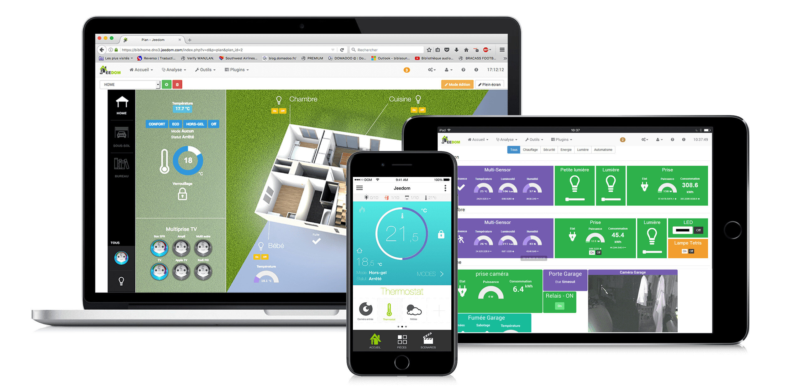
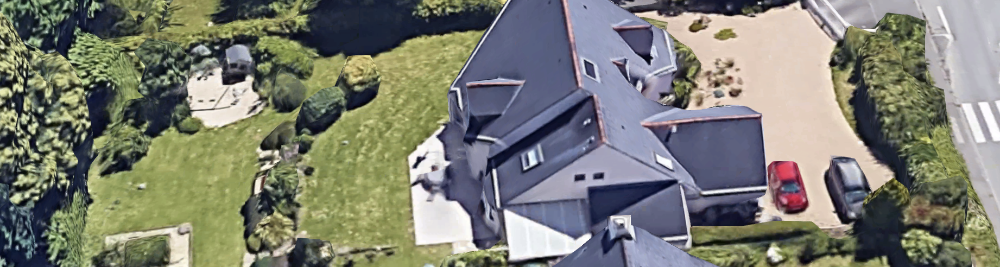

# Présentation du projet Domopoules

Présentation réalisé avec Remark.js pour le Dev and Test Day 2020 (Orange)
Appuyez sur P pour voir les notes. Puis C pour cloner l'affichage.

---

## Introduction

---

## Agenda

1. Présentation de Jeedom
1. Présentation du raspberry pi zero WH
2. Le problème de la portée
3. Le problème de l'alimentation
4. ...

---

## Présentation de Jeedom

???
Système très ouvert
TODO graphique Jeedom avec ses plugins

---

## Présentation du raspberry pi zero WH

TODO IMAGE

???
Pour ceux qui galèrent avec les arduino / ESP TODO
Un vrai linux accessible en SSH, un vrai IDE direct dessus (Vim), Git...
On peut écrire directement en python
Pas cher : TODO, mais il faut y ajouter la carte SD

---
## présentation de gpiozero

TODO add screenshots from
https://gpiozero.readthedocs.io/en/stable/recipes.html

---

## Le problème de la portée

Le poulailler est à TODO mètres de la box domotique

zigbee ==> KO
z-wave ==> MOUAIS
Wi-Fi ==> OK

---

### Mais c'est pas lié au protocole

Probablement plus au hardware

???

TODO images clés USB et image routeur WI-FI

---

## Le problème de l'alimentation

Naivement je pensais que le raspberry pi zero ne consommerait rien et tiendrait qques semaines sur une batterie USB...

Que Neni

