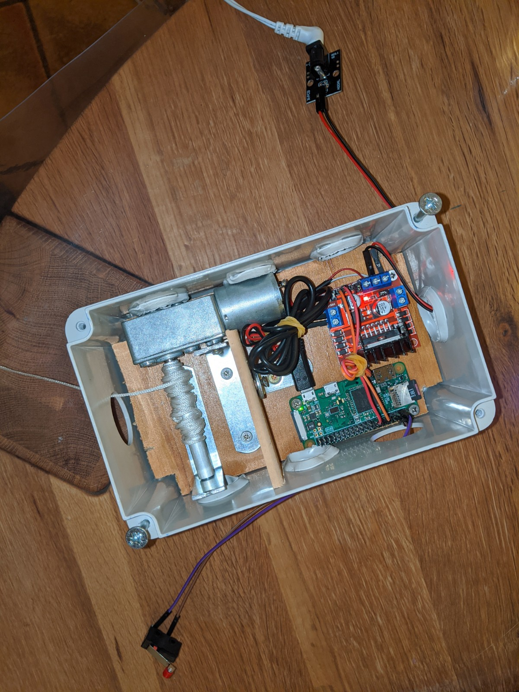

# Présentation du projet Domopoules

Présentation réalisé avec Remark.js pour le Dev and Test Day 2020 (Orange)
Appuyez sur P pour voir les notes. Puis C pour cloner l'affichage.

---

## Introduction

Les poules, parfait pour occuper les enfants pendant le confinement.

???
Mais pas mal de contraintes, dont ouvrir et fermer la porte matin et soir

---

## Introduction - 2

Le poulailler le lieu parfait pour innover en domotique.
Le WAF est très bon.

__Premier objectif : ouvrir automatiquement la porte du poulailler__

Objectifs suivants : présence des poules en intérieur, nombre d'oeufs.

---

## Des solutions éxistent sur le marché

???
Ici chickenguard
Mais cher(140€), pas domotisé, pas adapté à ma cabane.

---

## Agenda

1. Présentation de Jeedom
1. Présentation du raspberry pi zero WH
2. Le problème de la portée
3. Le problème de l'alimentation
4. ...

---

## Présentation de Jeedom

Open source. Français.

???
Système très ouvert : compatible zwave, philips Hue,  ikea...
TODO graphique Jeedom avec ses plugins

---

### Business model

Vente de:

- boxs sur étagère
- plugins
- service de sauvegarde
- noms de domaine

---

## Présentation du raspberry pi zero WH

Photo de famille : 0 / 1 / 2 / 3 / 4

---

## Présentation du raspberry pi zero WH - 2

<https://www.kubii.fr/cartes-raspberry-pi/2076-raspberry-pi-zero-wh-kubii-3272496009394.html>

???

Pour ceux qui galèrent avec les arduino / ESP TODO
Un vrai linux accessible en SSH, un vrai IDE direct dessus (Vim), Git...
On peut écrire directement en python
Pas cher : 10-15€, mais il faut y ajouter la carte SD

---
## présentation de gpiozero

TODO add screenshots from
https://gpiozero.readthedocs.io/en/stable/recipes.html

---

## Le problème de la portée

Le poulailler est à TODO mètres de la box domotique

zigbee ==> KO
z-wave ==> MOUAIS
Wi-Fi ==> OK

---

### Mais est-ce lié au protocole

Probablement plus au hardware

---

### Mais est-ce lié au protocole - 2

???

---

### La solution technique

---

## Le problème de l'alimentation

Naivement je pensais que le raspberry pi zero ne consommerait rien et tiendrait qques semaines sur une batterie USB...

Que Neni

---

## Alimentation solution

---

## Motion eye OS

---

## Pour aller plus loin

